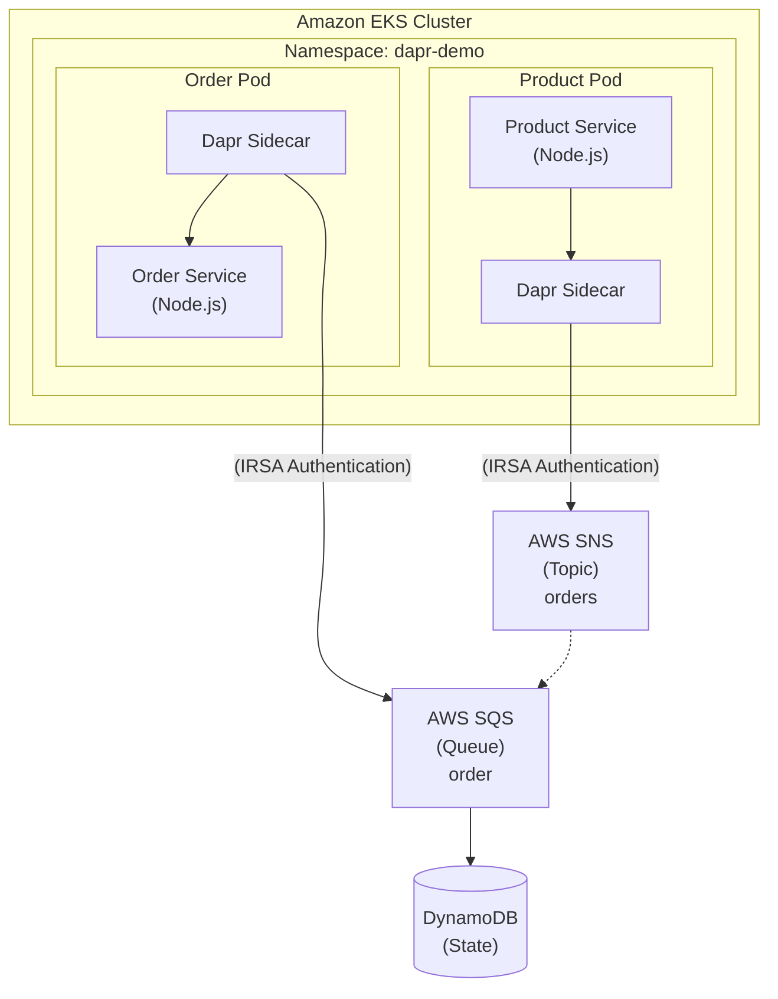
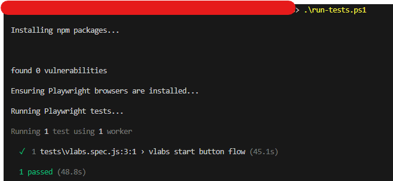

# Cloud Native Architecture Course - Introspect 1B: EKS Dapr Microservices

- [Cloud Native Architecture Course - Introspect 1B: EKS Dapr Microservices](#cloud-native-architecture-course---introspect-1b-eks-dapr-microservices)
  - [⚡ TL;DR - Quick Start](#-tldr---quick-start)
  - [📋 Overview](#-overview)
  - [🏗️ Architecture](#️-architecture)
  - [🔑 Key Features](#-key-features)
    - [Product Service](#product-service)
    - [Order Service](#order-service)
    - [Infrastructure Management](#infrastructure-management)
  - [📦 Repository Structure](#-repository-structure)
  - [🚀 Prerequisites](#-prerequisites)
  - [🧪 Lab Initialization Automation](#-lab-initialization-automation)
    - [Local Execution](#local-execution)
      - [Using PowerShell (Windows)](#using-powershell-windows)
      - [Using Bash (Linux/macOS)](#using-bash-linuxmacos)
      - [Manual Steps](#manual-steps)
    - [GitHub Actions](#github-actions)
  - [📥 Quick Start](#-quick-start)
    - [Step 1: Deploy Infrastructure with Terraform](#step-1-deploy-infrastructure-with-terraform)
    - [Step 2: Deploy Services](#step-2-deploy-services)
      - [Option A: Using GitHub Actions (CI/CD)](#option-a-using-github-actions-cicd)
      - [Option B: Local Simulation (Development)](#option-b-local-simulation-development)
  - [🧪 Testing and Verification](#-testing-and-verification)
    - [Quick Test](#quick-test)
    - [Manual Verification](#manual-verification)
      - [1. Check Pod Status](#1-check-pod-status)
      - [2. View End-to-End Message Flow](#2-view-end-to-end-message-flow)
      - [3. Verify Dapr Components](#3-verify-dapr-components)
  - [📊 Observing Real-Time Events](#-observing-real-time-events)
    - [Kubectl Log Streaming](#kubectl-log-streaming)
    - [Dapr Sidecar Logs](#dapr-sidecar-logs)
    - [AWS CloudWatch Logs](#aws-cloudwatch-logs)
    - [AWS SNS/SQS Monitoring](#aws-snssqs-monitoring)
    - [Real-Time Dashboard](#real-time-dashboard)
  - [🔧 Configuration](#-configuration)
    - [Terraform Variables](#terraform-variables)
    - [Scaling](#scaling)
    - [Resource Limits](#resource-limits)
  - [🐛 Troubleshooting](#-troubleshooting)
    - [Pods Not Starting](#pods-not-starting)
    - [Dapr Sidecar Issues](#dapr-sidecar-issues)
    - [AWS Permission Issues](#aws-permission-issues)
    - [Terraform State Issues](#terraform-state-issues)
  - [💰 Cost Considerations](#-cost-considerations)
  - [🧹 Cleanup](#-cleanup)
    - [Quick Cleanup](#quick-cleanup)
    - [Complete Infrastructure Cleanup](#complete-infrastructure-cleanup)
  - [📚 Key Concepts Demonstrated](#-key-concepts-demonstrated)
    - [1. Dapr Sidecar Pattern](#1-dapr-sidecar-pattern)
    - [2. Pub/Sub Messaging](#2-pubsub-messaging)
    - [3. Infrastructure as Code](#3-infrastructure-as-code)
    - [4. Kubernetes Best Practices](#4-kubernetes-best-practices)
    - [5. Event-Driven Architecture](#5-event-driven-architecture)
  - [📖 Learning Resources](#-learning-resources)
  - [🎯 Lab Objectives Met](#-lab-objectives-met)
  - [📝 License](#-license)
  - [🤝 Contributing](#-contributing)


A complete demonstration of containerized microservices deployed on Amazon EKS with Dapr sidecars implementing pub/sub messaging patterns using AWS SNS/SQS for real-time event-driven interactions.

## ⚡ TL;DR - Quick Start

**Get up and running in minutes using GitHub Actions automation!**

1. **Fork this repository** to your GitHub account

2. **Configure GitHub Secrets** (Settings → Secrets and variables → Actions → New repository secret):
   ```
   AWS_ACCESS_KEY_ID       = <your-aws-access-key>
   AWS_SECRET_ACCESS_KEY   = <your-aws-secret-key>
   ECR_REGISTRY            = <optional: your-account-id.dkr.ecr.region.amazonaws.com>
   SITE_USER               = <your-lab-username>
   SITE_PASSWORD           = <your-lab-password>
   ```

3. **Run the workflows** (Actions tab) in order:
   - **Step 1**: `1. Start Lab` - Initialize lab environment with Playwright automation (~2 min)
   - **Step 2**: `2. Deploy Terraform Infrastructure` - Provisions EKS, VPC, ECR, SNS/SQS, DynamoDB (~15 min)
   - **Step 3**: `3. Build and Deploy Microservices` - Builds and deploys services (~5 min)

4. **Verify deployment**:
   ```bash
   aws eks update-kubeconfig --region us-east-1 --name dapr-demo-cluster
   kubectl get pods -n dapr-demo
   kubectl logs -n dapr-demo -l app=product -c product --tail=10
   ```

**Available GitHub Actions workflows:**


That's it! Your microservices are now running on EKS with Dapr pub/sub messaging. 🚀

For detailed setup, local development, and troubleshooting, continue reading below.

---

## 📋 Overview

This project demonstrates:
- **Amazon EKS**: Managed Kubernetes cluster for container orchestration
- **Dapr**: Distributed Application Runtime for microservices
- **Pub/Sub Messaging**: Event-driven communication using AWS SNS/SQS
- **AWS DynamoDB**: State store for Dapr
- **IRSA**: IAM Roles for Service Accounts for secure AWS access
- **Infrastructure as Code**: Terraform for complete infrastructure provisioning
- **CI/CD**: GitHub Actions workflows for automated deployment
- **Real-time Observability**: Live monitoring of message flows

## 🏗️ Architecture



## 🔑 Key Features

### Product Service
- Automatically publishes order messages every 5 seconds
- Uses Dapr HTTP API to publish to AWS SNS topic
- Generates realistic order data (order ID, customer, product, etc.)
- Health check endpoint for Kubernetes probes
- Deployed with manual Dapr sidecar injection

### Order Service
- Subscribes to order messages via Dapr pub/sub from AWS SQS
- Implements Dapr subscription endpoint (`/dapr/subscribe`)
- Processes incoming orders with simulated business logic
- Tracks and displays received messages
- Supports multiple replicas (2 by default) for load distribution
- Uses IRSA for secure AWS access without credentials

### Infrastructure Management
- **Terraform**: Complete infrastructure as code
- **Two-stage deployment**: Infrastructure provisioning + service deployment
- **GitHub Actions**: Automated workflows for CI/CD
- **Local simulation**: Development-friendly deployment scripts
- **Cost-optimized**: Uses public subnets, no NAT Gateway

## 📦 Repository Structure

```
.
├── src/
│   ├── eks-dapr-microservices/
│   │   ├── product-service/
│   │   │   ├── app.js              # Product service application
│   │   │   ├── package.json        # Dependencies
│   │   │   └── Dockerfile          # Container image
│   │   ├── order-service/
│   │   │   ├── app.js              # Order service application
│   │   │   ├── package.json        # Dependencies
│   │   │   └── Dockerfile          # Container image
│   │   ├── terraform/
│   │   │   ├── main.tf             # Main Terraform configuration
│   │   │   ├── vpc.tf              # VPC and networking
│   │   │   ├── eks.tf              # EKS cluster configuration
│   │   │   ├── iam.tf              # IAM roles and policies (IRSA)
│   │   │   ├── ecr.tf              # ECR repositories
│   │   │   ├── aws-resources.tf    # SNS, SQS, DynamoDB
│   │   │   ├── kubernetes.tf       # Kubernetes resources
│   │   │   ├── helm.tf             # Dapr and Metrics Server
│   │   │   ├── variables.tf        # Input variables
│   │   │   ├── outputs.tf          # Output values
│   │   │   └── terraform.tfvars.example
│   │   ├── k8s/
│   │   │   ├── dapr-rbac.yaml           # RBAC for Dapr
│   │   │   ├── product-deployment.yaml  # Product deployment
│   │   │   ├── product-service.yaml     # Product service
│   │   │   ├── order-deployment.yaml    # Order deployment
│   │   │   └── order-service.yaml       # Order service
│   │   ├── dapr/
│   │   │   ├── pubsub.yaml         # Dapr pub/sub (AWS SNS/SQS)
│   │   │   ├── statestore.yaml     # Dapr state store (DynamoDB)
│   │   │   └── configuration.yaml  # Dapr configuration
│   │   ├── .github/workflows/
│   │   │   ├── terraform-deploy.yml     # Infrastructure workflow
│   │   │   └── deploy-services.yml      # Service deployment workflow
│   │   └── scripts/
│   │       ├── simulate-github-deploy.sh    # Local deployment simulation
│   │       ├── test.sh                      # Lab verification
│   │       └── cleanup.sh                   # Resource cleanup
│   └── labinit/
│       ├── tests/
│       │   └── vlabs.spec.js       # Playwright test for lab initialization
│       ├── playwright.config.js
│       ├── package.json
│       ├── start-lab.ps1           # PowerShell script for Windows
│       └── start-lab.sh            # Bash script for Linux/macOS
└── README.md                       # This file
```

## 🚀 Prerequisites

Before starting, ensure you have:

- **AWS CLI** (v2.x): [Installation Guide](https://docs.aws.amazon.com/cli/latest/userguide/getting-started-install.html)
- **Terraform** (~> 1.0): [Installation Guide](https://developer.hashicorp.com/terraform/install)
- **kubectl** (v1.27+): [Installation Guide](https://kubernetes.io/docs/tasks/tools/)
- **Docker**: [Installation Guide](https://docs.docker.com/get-docker/)
- **AWS Account** with appropriate permissions
- **AWS credentials** configured (`aws configure`)
- **Git**: For version control and commit SHA tracking

## 🧪 Lab Initialization Automation

The lab environment can be initialized automatically using a Playwright script that reproduces the same steps a student would perform manually. This automation ensures consistent and repeatable lab setup.

### Local Execution

#### Using PowerShell (Windows)

Use the PowerShell script to start the lab locally:

```powershell
cd src/labinit
.\start-lab.ps1
```

The script will:
1. Prompt for your credentials (username and password)
2. Install npm dependencies
3. Install Playwright browsers with system dependencies
4. Run the lab initialization tests

Alternatively, you can set credentials as environment variables:

```powershell
$env:SITE_USER = "youruser"
$env:SITE_PASSWORD = "yourpass"
.\start-lab.ps1
```

**Advanced options:**
```powershell
# Run with headed browser (visible UI)
.\start-lab.ps1 -Headed

# Enable trace recording for debugging
.\start-lab.ps1 -Trace

# Force reinstall of Playwright browsers
.\start-lab.ps1 -ReinstallBrowsers
```

#### Using Bash (Linux/macOS)

Use the bash script to start the lab locally:

```bash
cd src/labinit
./start-lab.sh
```

Set credentials as environment variables:

```bash
export SITE_USER="youruser"
export SITE_PASSWORD="yourpass"
./start-lab.sh
```

**Advanced options:**
```bash
# Pass credentials directly
./start-lab.sh --user youruser --password yourpass

# Run with headed browser (visible UI)
./start-lab.sh --headed

# Enable trace recording for debugging
./start-lab.sh --trace

# Force reinstall of Playwright browsers
./start-lab.sh --reinstall-browsers

# Show help
./start-lab.sh --help
```

#### Manual Steps

Or run the steps manually:

```bash
cd src/labinit
export SITE_USER="youruser"
export SITE_PASSWORD="yourpass"
npm ci
npx playwright install --with-deps
npm test
```

### GitHub Actions

The workflow `.github/workflows/ci.yml` automates the lab initialization using repository secrets:
- `SITE_USER`: username
- `SITE_PASSWORD`: password



## 📥 Quick Start

### Step 1: Deploy Infrastructure with Terraform

```bash
cd src/eks-dapr-microservices/terraform

# Copy and configure variables
cp terraform.tfvars.example terraform.tfvars
# Edit terraform.tfvars with your settings

# Initialize Terraform
terraform init

# Review the plan
terraform plan

# Apply infrastructure
terraform apply
```

**Terraform will create:**
- ✅ VPC with public subnets
- ✅ EKS cluster (v1.31) with managed node group (t3.medium × 2)
- ✅ ECR repositories for product-service and order-service
- ✅ SNS topic and SQS queue for pub/sub messaging
- ✅ DynamoDB table for state store
- ✅ IAM roles with IRSA for secure AWS access
- ✅ Dapr 1.12.5 installed via Helm
- ✅ Metrics Server for resource monitoring
- ✅ Kubernetes namespace and service account

### Step 2: Deploy Services

#### Option A: Using GitHub Actions (CI/CD)

1. Push your code to GitHub
2. Configure repository secrets:
   - `AWS_ACCESS_KEY_ID`
   - `AWS_SECRET_ACCESS_KEY`
   - `ECR_REGISTRY` (optional, defaults to `322230759107.dkr.ecr.us-east-1.amazonaws.com`)
3. Trigger the workflow:
   - **Automatic**: Push changes to `product-service/` or `order-service/`
   - **Manual**: Run workflow via GitHub Actions UI

The workflow will:
- Login to ECR
- Build Docker images for linux/amd64
- Push images to ECR
- Apply Dapr components and RBAC
- Deploy services to EKS
- Wait for rollout completion

#### Option B: Local Simulation (Development)

```bash
cd src/eks-dapr-microservices

# Deploy all services
./scripts/simulate-github-deploy.sh all

# Or deploy individual services
./scripts/simulate-github-deploy.sh product-service
./scripts/simulate-github-deploy.sh order-service
```

## 🧪 Testing and Verification

### Quick Test

```bash
cd src/eks-dapr-microservices/scripts
./test.sh
```

### Manual Verification

#### 1. Check Pod Status

```bash
kubectl get pods -n dapr-demo
```

Expected output:
```
NAME                       READY   STATUS    RESTARTS   AGE
product-xxxxxxxxxx-xxxxx   2/2     Running   0          2m
order-xxxxxxxxxx-xxxxx     2/2     Running   0          2m
order-xxxxxxxxxx-yyyyy     2/2     Running   0          2m
```

#### 2. View End-to-End Message Flow

```bash
kubectl logs -n dapr-demo -l app=product -c product --tail=10 && \
echo "---ORDER SERVICE---" && \
kubectl logs -n dapr-demo -l app=order -c order --tail=10
```

**Expected output:**

```text
✅ Published order: order-1765506590978-44 {
  orderId: 'order-1765506590978-44',
  customerId: 'customer-277',
  product: 'laptop',
  quantity: 5,
  totalAmount: '402.29',
  timestamp: '2025-12-12T02:29:50.978Z'
}
---ORDER SERVICE---
🚀 Order service listening on port 3001
👂 Subscribed to topic: orders
📦 [27] Received order: {
  orderId: 'order-1765506595980-45',
  product: 'phone',
  quantity: 1,
  amount: '162.09',
  timestamp: '2025-12-12T02:29:55.980Z'
}
✅ Order order-1765506595980-45 processed successfully
```

#### 3. Verify Dapr Components

```bash
kubectl get components -n dapr-demo
```

Expected output:
```
NAME             AGE
messagepubsub    5m
statestore       5m
```

## 📊 Observing Real-Time Events

### Kubectl Log Streaming

Watch both services simultaneously:

```bash
# Terminal 1 - Product Service
kubectl logs -f deployment/product -n dapr-demo -c product

# Terminal 2 - Order Service
kubectl logs -f deployment/order -n dapr-demo -c order
```

### Dapr Sidecar Logs

Monitor Dapr sidecar activity to see pub/sub component interactions:

```bash
# Product service Dapr sidecar
kubectl logs deployment/product -n dapr-demo -c daprd --tail=20

# Order service Dapr sidecar
kubectl logs deployment/order -n dapr-demo -c daprd --tail=20
```

**What to look for in Dapr logs:**
- Component initialization: `component loaded. name: messagepubsub, type: pubsub.snssqs`
- Message publishing: `published message to topic 'orders'`
- Message subscription: `subscribed to topic 'orders'`
- CloudEvents processing: `received cloud event`

### AWS CloudWatch Logs

CloudWatch Container Insights is automatically deployed with the Terraform infrastructure. You can view logs through the AWS Console:

1. **Navigate to CloudWatch**:
   ```
   AWS Console → CloudWatch → Log groups → /aws/eks/dapr-demo-cluster/cluster
   ```

2. **View Application Logs**:
   ```
   Log groups → /aws/containerinsights/dapr-demo-cluster/application
   ```

3. **Query logs using CloudWatch Insights**:
   ```sql
   fields @timestamp, kubernetes.pod_name, log
   | filter kubernetes.namespace_name = "dapr-demo"
   | filter kubernetes.container_name = "product" or kubernetes.container_name = "order"
   | sort @timestamp desc
   | limit 100
   ```

4. **Monitor Dapr component metrics**:
   ```sql
   fields @timestamp, kubernetes.pod_name, log
   | filter kubernetes.container_name = "daprd"
   | filter log like /published|subscribed|component/
   | sort @timestamp desc
   ```

**CloudWatch Resources Deployed:**
- EKS control plane logging (API, audit, authenticator, controllerManager, scheduler)
- CloudWatch agent DaemonSet for metrics collection
- Fluent Bit DaemonSet for log aggregation
- Automatic log group creation at `/aws/containerinsights/${cluster_name}/application`
- IAM roles with IRSA for secure CloudWatch access

### AWS SNS/SQS Monitoring

Monitor message flow through AWS services:

**SNS Topic Metrics** (CloudWatch):
```bash
# View in AWS Console
AWS Console → CloudWatch → Metrics → SNS → Topic Metrics → orders

# Or via CLI
aws cloudwatch get-metric-statistics \
  --namespace AWS/SNS \
  --metric-name NumberOfMessagesPublished \
  --dimensions Name=TopicName,Value=orders \
  --start-time $(date -u -d '1 hour ago' +%Y-%m-%dT%H:%M:%S) \
  --end-time $(date -u +%Y-%m-%dT%H:%M:%S) \
  --period 300 \
  --statistics Sum \
  --region us-east-1
```

**SQS Queue Metrics** (CloudWatch):
```bash
# View in AWS Console
AWS Console → CloudWatch → Metrics → SQS → Queue Metrics → order

# Monitor queue depth
aws sqs get-queue-attributes \
  --queue-url $(aws sqs get-queue-url --queue-name order --query QueueUrl --output text) \
  --attribute-names ApproximateNumberOfMessages \
  --region us-east-1
```

### Real-Time Dashboard

Create a CloudWatch dashboard for comprehensive monitoring:

```bash
# Navigate to CloudWatch → Dashboards → Create dashboard
# Add widgets for:
# - EKS pod CPU/Memory
# - SNS NumberOfMessagesPublished
# - SQS NumberOfMessagesReceived
# - Application logs from both services
```

## 🔧 Configuration

### Terraform Variables

Key variables in `terraform/variables.tf`:

| Variable | Description | Default |
|----------|-------------|---------|
| `aws_region` | AWS region | `us-east-1` |
| `cluster_name` | EKS cluster name | `dapr-demo-cluster` |
| `node_instance_type` | EC2 instance type | `t3.medium` |
| `node_desired_capacity` | Desired node count | `2` |
| `kubernetes_version` | Kubernetes version | `1.31` |
| `dapr_version` | Dapr Helm chart version | `1.12` |
| `namespace` | Kubernetes namespace | `dapr-demo` |

### Scaling

Scale order service replicas:

```bash
kubectl scale deployment/order -n dapr-demo --replicas=5
```

### Resource Limits

Adjust in `k8s/*-deployment.yaml`:

```yaml
resources:
  requests:
    memory: "128Mi"
    cpu: "100m"
  limits:
    memory: "256Mi"
    cpu: "200m"
```

## 🐛 Troubleshooting

### Pods Not Starting

```bash
kubectl describe pod <pod-name> -n dapr-demo
kubectl get events -n dapr-demo --sort-by='.lastTimestamp'
```

### Dapr Sidecar Issues

```bash
kubectl logs <pod-name> -n dapr-demo -c daprd
```

### AWS Permission Issues

Check IRSA configuration:

```bash
kubectl describe sa dapr-service-account -n dapr-demo
```

Verify IAM role annotations:

```bash
kubectl get sa dapr-service-account -n dapr-demo -o yaml | grep eks.amazonaws.com/role-arn
```

### Terraform State Issues

If you need to refresh state:

```bash
cd src/eks-dapr-microservices/terraform
terraform refresh
```

## 💰 Cost Considerations

This configuration creates resources that incur costs:

- **EKS Cluster**: ~$0.10/hour (~$72/month)
- **EC2 Instances** (t3.medium × 2): ~$0.0416/hour each (~$60/month total)
- **NAT Gateway**: Not used (cost-optimized)
- **DynamoDB**: Pay per request
- **SNS/SQS**: Pay per request
- **ECR**: Storage costs

**Estimated monthly cost**: ~$75-100 USD (may vary by usage)

⚠️ **Remember to destroy resources when not in use!**

## 🧹 Cleanup

### Quick Cleanup

```bash
cd src/eks-dapr-microservices
./scripts/cleanup.sh
```

### Complete Infrastructure Cleanup

```bash
# Delete Kubernetes resources first
cd src/eks-dapr-microservices
kubectl delete -f k8s/ -n dapr-demo --ignore-not-found=true
kubectl delete configmap dapr-components -n dapr-demo --ignore-not-found=true

# Then destroy Terraform infrastructure
cd terraform
terraform destroy
```

This will remove:
- All deployed services and pods
- Dapr components and RBAC
- EKS cluster and node groups
- VPC and networking resources
- ECR repositories and images
- SNS topics and SQS queues
- DynamoDB tables
- IAM roles and policies

## 📚 Key Concepts Demonstrated

### 1. Dapr Sidecar Pattern
Each pod contains two containers:
- Application container (product/order service)
- Dapr sidecar container (handles infrastructure concerns)

### 2. Pub/Sub Messaging
- **Decoupling**: Product and order services don't know about each other
- **Scalability**: Multiple order replicas can process messages
- **Reliability**: AWS SNS/SQS ensures message delivery
- **CloudEvents**: Standard format for event data

### 3. Infrastructure as Code
- **Terraform**: Declarative infrastructure provisioning
- **Idempotent**: Safe to run multiple times
- **State Management**: Tracks infrastructure changes
- **Dependency Resolution**: Automatic resource ordering

### 4. Kubernetes Best Practices
- Health checks (liveness/readiness probes)
- Resource limits and requests
- Namespaces for isolation
- RBAC for security
- ConfigMaps for configuration

### 5. Event-Driven Architecture
- Asynchronous communication
- Real-time message processing
- Horizontal scalability
- Resilient messaging

## 📖 Learning Resources

- [Dapr Documentation](https://docs.dapr.io/)
- [Amazon EKS Documentation](https://docs.aws.amazon.com/eks/)
- [Kubernetes Documentation](https://kubernetes.io/docs/)
- [Terraform AWS Provider](https://registry.terraform.io/providers/hashicorp/aws/latest/docs)
- [Dapr Pub/Sub Tutorial](https://docs.dapr.io/developing-applications/building-blocks/pubsub/)
- [EKS Best Practices](https://aws.github.io/aws-eks-best-practices/)

## 🎯 Lab Objectives Met

✅ **Deploy containerized microservices on Amazon EKS**
- Product and order services containerized with Docker
- Deployed to managed EKS cluster with Terraform

✅ **Implement Dapr sidecars**
- Dapr sidecar manually injected into each pod
- Handles all pub/sub communication via AWS SNS/SQS

✅ **Pub/Sub messaging pattern**
- AWS SNS/SQS-backed pub/sub component
- Real-time event publishing and subscription
- CloudEvents format for message delivery

✅ **Observe real-time interactions**
- Live log streaming shows message flow
- Multiple order replicas demonstrate load distribution
- IRSA provides secure AWS access

✅ **Infrastructure as Code**
- Complete Terraform configuration
- Automated infrastructure provisioning
- State management and drift detection

## 📝 License

This project is for educational purposes as part of Introspect1B for Cloud Native Architecture Level 2.

## 🤝 Contributing

Feel free to submit issues or pull requests for improvements!

