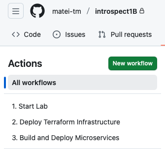

# Cloud Native Architecture Course - Introspect 1B: EKS Dapr Microservices

- [Cloud Native Architecture Course - Introspect 1B: EKS Dapr Microservices](#cloud-native-architecture-course---introspect-1b-eks-dapr-microservices)
  - [⚡ TL;DR - Quick Start](#-tldr---quick-start)
  - [📝 License](#-license)
  - [🤝 Contributing](#-contributing)


A complete demonstration of containerized microservices deployed on Amazon EKS with Dapr sidecars implementing pub/sub messaging patterns using AWS SNS/SQS for real-time event-driven interactions.

## ⚡ TL;DR - Quick Start

**Get up and running in minutes using GitHub Actions automation!**

1. **Fork this repository** to your GitHub account

2. **Configure GitHub Secrets** (Settings → Secrets and variables → Actions → New repository secret):
   ```
   AWS_ACCESS_KEY_ID       = <your-aws-access-key>
   AWS_SECRET_ACCESS_KEY   = <your-aws-secret-key>
   ECR_REGISTRY            = <mandatory: your-account-id.dkr.ecr.region.amazonaws.com>
   SITE_USER               = <your-lab-username>
   SITE_PASSWORD           = <your-lab-password>
   ```

3. **Configure Repository Variables** (Settings → Secrets and variables → Actions → Variables tab → New repository variable):
   ```
   ENABLE_SCHEDULED_DEPLOYMENT = true    # Optional: Enable scheduled deployments based on the cron set on action scheduled-ops-deployment.yml
   ```
   > **Note**: If not set, scheduled deployments will be disabled by default. You can still run the workflow manually.

4. **Run the workflows** (Actions tab):
   **Available GitHub Actions workflows:**

   

   - **Step**: `1. Start Lab` - Initialize lab environment with Playwright automation (~2 min)
   - **Step**: `2. Deploy Terraform Infrastructure` - Provisions EKS, VPC, ECR, SNS/SQS, DynamoDB (~15 min)
   - **Step**: `3. Build and Deploy Microservices` - Builds and deploys services (~5 min)
   - **Step**: `4. Test and Collect Logs` - Comprehensive testing and log collection (~2 min)
   - **Verify**: Downloads logs as artifact (30-day retention) with detailed test results and service logs

That's it! Your microservices are now running on EKS with Dapr pub/sub messaging. 🚀

   

For detailed setup, local development, and troubleshooting, continue reading the [wiki](https://github.com/matei-tm/introspect1B/wiki).

## 📝 License

This project is for educational purposes as part of Introspect1B for Cloud Native Architecture Level 2.

## 🤝 Contributing

Feel free to submit issues or pull requests for improvements!